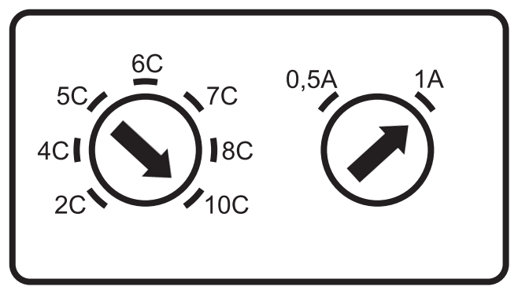
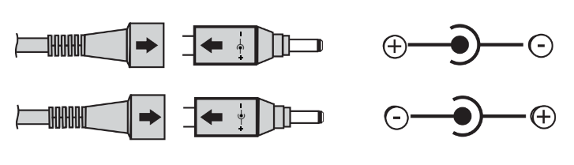

# Robotics 2 – Mobile Robotics
Prof. Dr. Gabriel Gruener
# Yellow Hardware

## Charger Configuration
You charge Yellow's batteries using the *VOLTCRAFT* charger you received at the beginning of the semester.

The charger must be set to charge with **10 cells** and **1000 mA**, as displayed in the image below.

#### Connector Polarity
The connector must be attached with the right polarity: The arrow on the cable must point to (+ inside, - outside), as shown in the upper part of this image:

#### Charging Yellow's Batteries
Plug in the connector into the robot's socket (located above and to the right of the BFH logo and labeled `CHARGE`). The *VOLTCRAFT* charger's LED will light up red.

When **fully charged the LED will turn green**.

## Components
Documentation of the components on board Yellow is found under the directory [Components](Components).

The available connectors on Yellow's PCB are summarized in [Yellow-PCB_Connnectors.pdf](Yellow-PCB_Connnectors.pdf).

The mappings between these components and Nucleo/STM32 pins is documented in [Yellow-Nucleo_Pin_Functions.pdf](Yellow-Nucleo_Pin_Functions.pdf).
