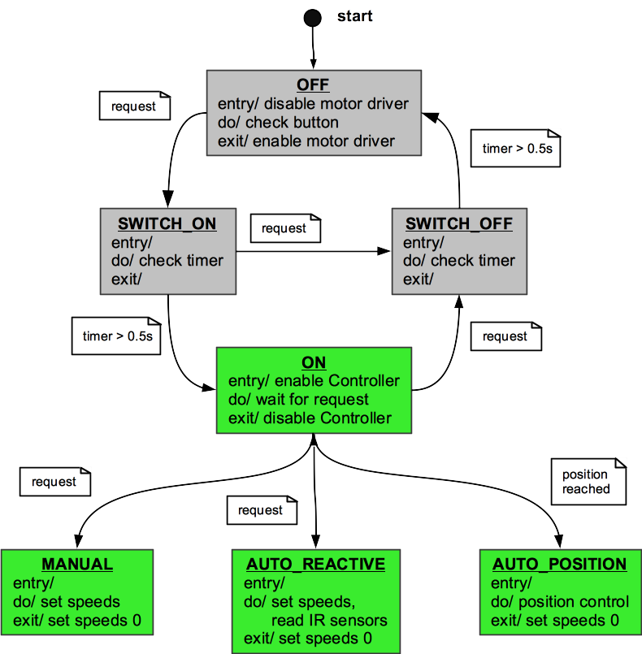

# Robotics 2 – Mobile Robotics
Prof. Dr. Gabriel Gruener

## Exercise 3

### Goal
* Get to know the `Motion` class.
* Get to know the `StateMachine` class.
* Implement the active states of the `StateMachine` class.

### Procedure
1. Update your project from the git upstream (refer to [../README.md](../README.md)).
  

1. **Wheel Motion Planner**  
	Inspect the new `Motion` class defined in `Motion.h`. This class manages motion values for `position` and `velocity`, offering methods to increment them towards a desired target position or velocity, enabling smooth motions.
	  
  Motion planners for the translational and rotational velocities have been added at the beginning of `Controller::run()`.
	  
	1.  Adapt your code in `Controller::run()` from Ex2.1 to use `translationalMotion.velocity` and `rotationalMotion.velocity` to calculate the desired wheel speeds.

		**Hint**: Look for the `TODO` Ex3.1 comment inside `Controller.cpp`.
  

1. **State Machine**  
	Inspect the new `StateMachine` class defined in `StateMachine.h`. This class partly implements the State Machine shown below based on an enumeration and a `switch`-`case` statement.  
	Your task is to complete the implementation.

	

	Note that, in general, you usually transition from the **OFF** state (motors disabled) to one of the 3 active states **MANUAL**, **AUTO_REACTIVE** or **AUTO_POSITION**.  
	The **SWITCH_ON** and **SWITCH_OFF** states are used only transitorily. In the **ON** state the `Controller` is running so the robot will try to maintain a zero velocity.
	  

	**IMPORTANT**: The `StateMachine` should now become the only object giving commands to the `Controller`. Therefore, you will have to move existing code from `Main` to `StateMachine`.
	  

	`Main.cpp` contains a code example that sets the desired state of the state machine.  
	The State Machine has 3 actively controlled states:
	  

	A. **MANUAL**  
	This state shall simply pass on to the `Controller` the currently desired translational and rotational velocities (see `StateMachine::setVelocities()`).  
	Note: you should now only use `StateMachine::setVelocities()` from Main and not call `Controller::setTranslationalVelocity()` or `Controller::setRotationalVelocity()` directly.  
	You enter and exit the **MANUAL** state by requesting a state change with `StateMachine::setDesiredState()`.
	  

	B. **AUTO_REACTIVE**  
	This state shall implement **Reactive Navigation**. The robot shall drive straight at a constant speed until the IR sensors report an inminent collision. Then, an angular velocity shall be added to avoid the collision.  
	You enter and exit the **AUTO_REACTIVE** state by requesting a state change with `StateMachine::setDesiredState()`.
	  

	C. **AUTO_POSITION**  
	This state shall implement a position control as shown in the **Position Control**  lecture of the course (e.g. the **step-wise maneuver**).  
	The goal pose is settable with the method `StateMachine::setGoalPose()` (see example in `Main.cpp`).  
	You can retrieve the current estimated global pose from `Controller::getX()` and similar methods and use it to implement your Position Control.
	You enter and exit the **AUTO_POSITION** state by requesting a state change with `StateMachine::setDesiredState()`. The state shall also exit automatically when the goal pose has been reached.
	  

	Your tasks:
	1. At the beginning of `StateMachine::run()` read the IR sensors and activate the corresponding LEDs. Move your code developed in Ex1.4 & 1.5 from `Main`.  
		**Hint**: Look for `TODO` Ex3.2 comment inside `StateMachine.cpp`.
		  
	1. Implement the **`MANUAL`** state.  
		Yellow shall drive with the desired translational / rotational velocities.  
		**Hint**: Look for `TODO` Ex3.3 comment inside `StateMachine.cpp`.
		  
	1. Implement the **`AUTO_REACTIVE`** state.  
		Drive straight at a constant linear velocity and react to the distances reported by the IR sensors. Yellow shall avoid obstacles while driving around.  
		You can test the reactive navigation by placing the robot inside a labyrinth made out of styrofoam walls. Yellow shall be able to find the exit of a one-track labyrinth.  
		**Hint**: Look for `TODO` Ex3.4 comment inside `StateMachine.cpp`.
		  
	1. Implement the **`AUTO_POSITION`** state.  
		Implement a ***step-wise maneuver*** position control. Refer to the **Position Control**  lecture of the course. Optionally, you may also implement the ***direct maneuver*** position control.   
		**Hint**: Look for the `TODO` Ex3.5 comment inside `StateMachine.cpp`.
