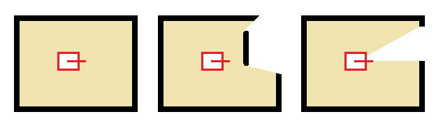
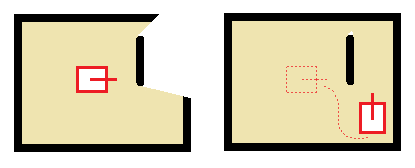

<a href="https://www.bfh.ch/de/studium/bachelor/mikro-medizintechnik/" target="blank">

</a>

# Robotics 2 – Mobile Robotics
Prof. Dr. Gabriel Gruener

## Exercise 5

### Goal
* Filter the encoder data with a **low-pass filter**.
* Construct an occupancy grid from LIDAR line data.
* Create a map by filling the occupancy grid as the robot moves.

### Procedure
1. Update your project from the git upstream (refer to [../README.md](../README.md)).
<br><br>

1. **Low-pass Filter**  
	Inspect the new class defined in `LowpassFilter.h`. This class implements a digital low-pass filter.  
	The estimated wheel velocities are noisy and should be filtered.  
	A `LowpassFilter` for each wheel velocity has been added to the controller class. See members `Controller::speedLeftFilter` and `Controller::speedRightFilter` and the filter cut-off frequency constant `Controller::LOWPASS_FILTER_FREQUENCY`. The cut-off frequency is set inside the constructor of the `Controller` class.
	1. Filter the estimated motor speeds, which you implemented in [Exercise 2](Exercise02.md).  
	**Hint**: Look for the `TODO` Ex5.1 comment inside `Controller.cpp`.
<br><br>

1. **Occupancy Grid**  
	1. Use LIDAR line data (from [Exercise 4](Exercise04.md)) to construct an occupancy grid of the robot's local environment (in the robot frame). You may want to create new *Matlab* scripts for that.
	1. Try out different labyrinth structures using styrofoam blocks without moving your robot. Start with a simple closed square around the robot. Try creating a small opening in a wall. Try adding a styrofoam block inside the square so that the robot is unable to see all walls of the closed square.
	

1. **Build a map**  
	Build a map by creating an initial occupancy grid as above, then drive the robot to a new position to gather additional data.

	Inside a *Matlab* script you can retrieve the robot's estimated pose from the telemetry:
	```Matlab
	yellow.receive.odometry.pose
	```
	**Note**: You have to make sure the telemetry optional *odometry.pose* is available. Refer to the [../Remote/Matlab/yellowTelemetry](../Remote/Matlab/yellowTelemetry.m) script.
	<br><br>

	For example, the figure below shows how the robot makes a first LIDAR scan and builds an initial occupancy grid. Then the robot moves to a new position and acquires new LIDAR line data. Merging together the odometry and the new line data, the occupancy grid can be updated.  
	

	1. Use odometry data to create a transformation matrix betweeen robot motions. Then combine LIDAR line data from two separate positions linked through the transformation matrix. So you will build a map in the world reference frame.  
	**Note**: Remember that odometry is very imperfect. Therefore, do not be surprized if your map does not resemble reality very closely.
	<br><br>

	**Note**: Matlab has an official *Robotics System Toolbox*. This toolbox includes a class *OccupancyGrid* that may be useful for this task.  
	You may also consider looking at Peter Corke's Matlab *Robotics and Vision Toolbox*. It has many algorithms, tools and code examples that may be useful to handle LIDAR scans, create occupancy grids and plan robot paths.  
