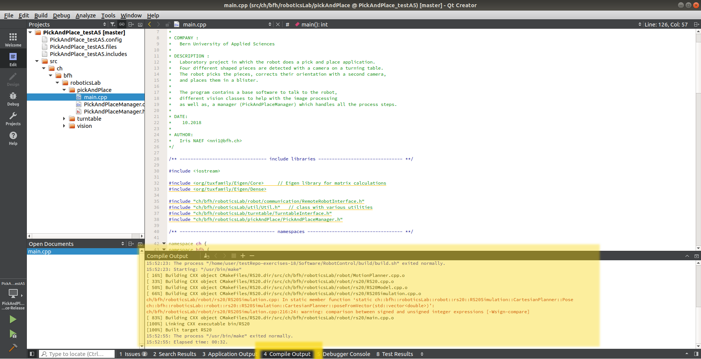

# QtCreator Project Configuration
If you choose to use the *Qt-Creator IDE* for editing your source files, you can follow this manual to create (and open) a Qt-project from the existing source files.

Instead of compiling the program from a terminal and flashing the microcontroller manually (as explained in the [README](README.md)), you can also **compile and flash inside the *Qt-Creator IDE***.

## 1. Create a Qt-project form existing source files

If you want to work on the code using the QtCreator IDE, you can create a Qt-project by following these steps:

1. Open *Qt-Creator*
1. Select `New Project` or go to `File` > `New File or Project...`.  
  
1. In the menu `Import Project` select `Import Existing Project`.  
  
1. Define an appropriate project name and choose the project location by selecting the `Software` folder (level in which you can see the `src` folder):  
  
  
1. Leave the `File Selection` step as it is. Normally it chooses the right files. However, if you see that it wants to include files inside the `build` directory, uncheck that directory.  
  
1. Remove version control and choose `Finish`.  
  
1. In order to let Qt recognize and find all source files, we have to define the location of the local project files (`src`) inside the `.includes`-file. Do not forget to **save** the `.includes`-file before closing it.  
  

## 2. Open a Qt-project

If you created a Qt-project as described in the last section, you can then easily open it in one of the following ways.

*Option 1*: If you open the Qt-Creator IDE, you will probably find your project on the list of *Recent projects*, so you can just select it.

*Option 2*: You can open the project (inside the Qt-Creator IDE) by selecting `File` -> `Open File or Project...` (or pressing `Ctrl`+`O`) and then browsing to the `.creator`-file inside the `Software` folder.

*Option 3*: You can also open your project, **without opening QtCreator beforehand**, by double clicking the `.creator`-file inside the `Software` folder. The file should open automatically inside Qt-Creator.

## 3. Configure Build & Run Settings
Open your Qt-project inside the QtCreator IDE and follow these steps:

#### 3.1 Build Settings
You should be able to compile your project inside the Qt Creator by using a **MinGW compiler**. If you have such a compiler installed, you can choose it in the `Projects` menu under `Build & Run` (Just click the *MinGW compiler* Kit).

If you do not have this Compiler Kit already installed, follow these steps:

1. In the Windows search area, search for `Qt Maintenance Tool` and start the program.
1. Choose `next`.
1. `Skip` the *Qt Account* step.
1. Choose `Add or remove components`.
1. Open the components group `Qt` and the newest Qt Version (i.e. `Qt 5.12.0`). Check the box for the *MinGW* Component (i.e. `MinGW 7.3.0 64-bit`).  
  
1. Choose `Next` and then `Update`.

#### 3.2 Run Settings
Setup the IDE to automatically flash the microcontroller with the binary file.

1. Switch to the `Projects` menu.  
  
1. Select the `Run Settings`.  
  
1. Under the section *Deployment* select `Add Deploy Step` > `Custom Process Step`.  
  
1. As *Command* enter: `xcopy`  
  As *Arguments* enter the binary and the drive you want to copy it on: `build\Yellow.bin D:\`
  You may need to change the drive name, as you may have multiple drives on your laptop.  
  
1. To change again into the normal menu, change to the `Edit` menu (*Text Editor*).

## 4. Compile & Flash inside QtCreator

#### 4.1 Compile
To compile your project press **`CTRL`+`B`**. You will see any compilation warnings and errors on the bottom of the window inside the `Compile Output` tab:

  

#### 4.2 Flash

To upload your program to Yellow press **`CTRL`+`R`**. The `Yellow.bin` file will be copied to Yellow.

## 5. FAQ

#### 5.1 Add new source files to the project tree
When there is a new source file inside the Software folder, you need to add them to your Qt-project, in order to display them in the `Projects` tree. To do that, right-click on the project and choose `Edit Files...` .   

