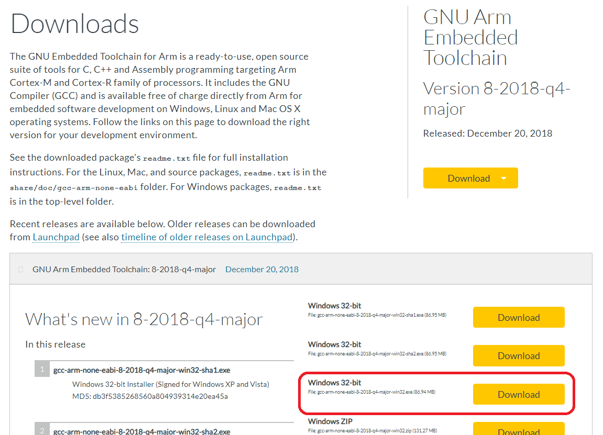

<a href="https://www.bfh.ch/de/studium/bachelor/mikro-medizintechnik/" target="blank">

</a>

# Robotics 2 – Mobile Robotics
Prof. Dr. Gabriel Gruener

# Yellow Software
This directory contains the software project and source code to be run on Yellow's on-board *STM* microcontroller.

The Software runs on an Arm processor but is compiled on your PC, a process called **cross-compilation**. The following instructions apply for Microsoft Windows systems. If you use a different system, ask the professor.

## 1. Requirements
### 1.1. Installation Location
**ATTENTION**: This git repository must be installed in a directory with a *clean* path:  
**the path may only contain alphanumeric characters (letters, numbers and '_')**.

### 1.2. Cross-Compilation Tools
The Yellow software is compiled using

* `GNU ARM Embedded Toolchain` (version 8-2018-q4-major)
* `GNU make` for Windows (version 4.0 or above)

#### 1.2.1. Arm Cross Compiler
To get the latest *ARM* cross-compiler (version 8-2018-q4-major), follow these steps:

1. Download the *GNU ARM Embedded Toolchain* installer from the following link (32-bit executable, see image below):  
  [https://developer.arm.com/open-source/gnu-toolchain/gnu-rm/downloads](https://developer.arm.com/open-source/gnu-toolchain/gnu-rm/downloads)
  

1. Run the installer you just downloaded (`gcc-arm-none-eabi-2018-q4-major-win32.exe`).
1. Select an installation language.
1. Choose `next`.
1. Agree to the License Agreement.
1. **IMPORTANT**: Change the installation directory to:  
  `C:\GNU\arm\2018-q4-major\`
1. Choose `Install`.
1. When the installation process is done, choose `Finish`. (You can close the text-file and command window that automatically open.)


#### 1.2.2. GNU Make
To get `GNU make` for Microsoft Windows (version 4.2.1):

1. Uninstall any previous version of Make for Windows, if you already have it. A `uninstall.exe` file is provided with the distribution. (You will probably find this file under `C:\GNU\make\uninstall\uninstall.exe`)

1. Create a new directory as `C:\GNU\Make\bin\` .

1. Download *make 4.2.1* for Windows:  
  [https://github.com/mbuilov/gnumake-windows/blob/master/gnumake-4.2.1-x64.exe](https://github.com/mbuilov/gnumake-windows/blob/master/gnumake-4.2.1-x64.exe)

1. Rename the downloaded `gnumake-4.2.1-x64.exe` to `make.exe` .

1. Move the renamed `make.exe` to the GNU make directory you created above to get:  
  `C:\GNU\make\bin\make.exe` .


#### 1.2.3. Update Path
Now you need to update the Microsoft Windows `Path` system variable:

1. In the Windows search area, search for `Control Panel` (For German Windows: `Systemsteuerung`).
1. Choose the menu `System` (German: `System und Sicherheit` < `System`).
1. On the left side choose the `Advanced system settings` (German: `Erweiterte Systemeinstellungen`).
1. On the bottom left choose `Environment Variables…` (German: `Umgebungsvariablen…`).
1. In the section `System Variables`, find the `Path` environment variable and select it. Then choose `Edit…` . If the variable does not exist create a new variable with `New…` .
1. Add a new entry for this environment variable by clicking `New`. Enter the full path to the GNU Make executable:  
  `C:\GNU\make\bin\`
1. Choose `OK`.
1. Close all remaining windows by clicking `OK`.

## 2. Compilation
All cross-compilation tools are ready. Now you can compile the Yellow C++ source code in Windows using the *CMD console*.

1. Open a new command prompt. (In the windows search bar type `cmd`.)
1. If you are not on the same drive, on which your repository lays, you need to change to this drive.  
For example, to switch to the C:\ drive, enter:  
    ``` bash
    > c:
    ```
1. Go to your group repository into the subfolder `Software`:  
    ``` bash
    > cd yourPathToYourRepository/project-19_groupNumber/Software
    ```
1. Type `make` and then press `Enter`.
1. A `build` directory will be created with the full compilation.  
**Note**: The first time you compile **will take several minutes** because the complete Arm mbed-os will be compiled. Subsequent compilations shall be much faster as only few files will need to be recompiled.   
 After successful compilation you will find the Arm executable file `Yellow.bin` inside the `build` directory.

## 3. Upload and Program Execution
To run your compiled program `Yellow.bin` you upload it into your microcontroller:

1. Connect the Nucleo board on the robot to your PC with the USB cable.
1. On your PC an external drive (German: Laufwerk) will appear.
1. Drag and drop the `Yellow.bin` file to the Nucleo drive.
1. The file will be copied to the robot and installed as boot file.  
The robot will automatically reboot and execute your updated file.  
During reboot the Nucleo drive will disappear from your PC.  
When the Nucleo drive reappears, you will not see the `Yellow.bin` file, as it has been processed.

## 4. QtCreator project
If you would like to program and edit the Yellow C++ source code using the Qt IDE, refer to the [QtCreator-project configuration manual](QtCreator-projectConfiguration-Windows.md).
